<<<<<<< HEAD
# AgriSmart Backend - Smart Irrigation and Crop Monitoring System

[](https://www.sih.gov.in/)
[](https://fastapi.tiangolo.com/)
[](https://python.org/)
[](https://supabase.com/)

## Project Overview

AgriSmart is an AI-powered agriculture management system developed for **Smart India Hackathon 2025 (SIH25044)**. This backend provides comprehensive APIs for crop monitoring, yield prediction, disease detection, pest classification, and intelligent irrigation scheduling. Designed for small to medium-scale farmers in India, it addresses critical challenges like water conservation and crop health monitoring.

## 🌟 Key Features

- **🔐 Authentication**: JWT + Google OAuth integration
- **🤖 ML Predictions**: Crop yield, disease detection, pest classification  
- **💧 Smart Irrigation**: Weather-based irrigation scheduling
- **📊 Analytics Dashboard**: Comprehensive farming insights
- **🔄 Real-time Monitoring**: Crop health and environmental tracking
- **📱 Multi-platform Support**: REST API for web/mobile clients

## 🏗️ Architecture

```
app/
├── main.py                 # FastAPI application entry point
├── database.py            # Supabase client and operations
├── models/
│   └── schemas.py         # Pydantic models for API validation
├── services/
│   ├── auth.py           # Authentication service
│   ├── ml.py             # Machine learning service  
│   └── irrigation.py     # Irrigation scheduling service
├── apis/                 # API route handlers
│   ├── auth.py           # Authentication endpoints
│   ├── predictions.py    # ML prediction endpoints
│   ├── irrigation.py     # Irrigation endpoints
│   └── dashboard.py      # Dashboard and analytics endpoints
├── utils/
│   ├── security.py       # JWT and security utilities
│   └── logging.py        # Logging configuration
└── ml_models/
    └── saved_models/     # Trained ML models storage
```

## 🚀 Quick Start

### Prerequisites

- Python 3.13+
- Supabase account
- Google OAuth credentials (optional)

### 1. Clone and Setup

```bash
git clone <repository-url>
cd agrismart-backend
```

### 2. Install Dependencies

```bash
pip install -r requirements.txt
```

### 3. Environment Configuration

Copy `.env.example` to `.env` and configure:

```bash
cp .env.example .env
```

Update the following variables:

```env
# Supabase Configuration
SUPABASE_URL=your_supabase_project_url
SUPABASE_ANON_KEY=your_supabase_anon_key
SUPABASE_SERVICE_ROLE_KEY=your_service_role_key

# JWT Configuration  
SECRET_KEY=your_super_secret_jwt_key_here_make_it_long
ALGORITHM=HS256
ACCESS_TOKEN_EXPIRE_MINUTES=30

# Google OAuth (Optional)
GOOGLE_CLIENT_ID=your_google_oauth_client_id
GOOGLE_CLIENT_SECRET=your_google_oauth_client_secret

# Frontend API Key (Share with frontend teams)
API_KEY=AgriSmart-2025-Key123
```

### 4. Database Setup (Supabase)

Execute the following SQL in your Supabase SQL editor:

```sql
-- Enable UUID extension
CREATE EXTENSION IF NOT EXISTS "uuid-ossp";

-- Users table
CREATE TABLE users (
    id UUID PRIMARY KEY DEFAULT uuid_generate_v4(),
    name VARCHAR(100) NOT NULL,
    email VARCHAR(100) NOT NULL UNIQUE,
    phone VARCHAR(15) NOT NULL,
    region VARCHAR(100) NOT NULL,
    farm_size NUMERIC(10, 2) NOT NULL,
    main_crops VARCHAR(200) NOT NULL,
    password_hash TEXT NOT NULL,
    member_since INTEGER NOT NULL,
    predictions_count INTEGER DEFAULT 0,
    accuracy_rate VARCHAR(10) DEFAULT '0%',
    last_prediction VARCHAR(50) DEFAULT 'Never',
    created_at TIMESTAMP DEFAULT now()
);

-- Predictions table
CREATE TABLE predictions (
    id UUID PRIMARY KEY DEFAULT uuid_generate_v4(),
    user_id UUID NOT NULL REFERENCES users(id) ON DELETE CASCADE,
    prediction_type VARCHAR NOT NULL,
    crop_type VARCHAR NOT NULL,
    input_data JSONB NOT NULL,
    predictions JSONB NOT NULL,
    confidence FLOAT NOT NULL,
    recommendations JSONB NOT NULL,
    created_at TIMESTAMP DEFAULT now()
);

-- Irrigation logs table
CREATE TABLE irrigation_logs (
    id UUID PRIMARY KEY DEFAULT uuid_generate_v4(),
    user_id UUID NOT NULL REFERENCES users(id) ON DELETE CASCADE,
    schedule_date TIMESTAMP NOT NULL,
    duration_minutes INTEGER NOT NULL,
    water_volume NUMERIC(10, 2) NOT NULL,
    weather_data JSONB NOT NULL,
    created_at TIMESTAMP DEFAULT now()
);

-- Enable Row Level Security
ALTER TABLE users ENABLE ROW LEVEL SECURITY;
ALTER TABLE predictions ENABLE ROW LEVEL SECURITY;
ALTER TABLE irrigation_logs ENABLE ROW LEVEL SECURITY;

-- RLS Policies for team collaboration
CREATE POLICY "Users can view own data" ON users FOR SELECT USING (auth.uid()::text = id::text);
CREATE POLICY "Users can update own data" ON users FOR UPDATE USING (auth.uid()::text = id::text);
CREATE POLICY "Users can view own predictions" ON predictions FOR SELECT USING (auth.uid()::text = user_id::text);
CREATE POLICY "Users can create predictions" ON predictions FOR INSERT WITH CHECK (auth.uid()::text = user_id::text);
CREATE POLICY "Users can view own irrigation logs" ON irrigation_logs FOR SELECT USING (auth.uid()::text = user_id::text);
CREATE POLICY "Users can create irrigation logs" ON irrigation_logs FOR INSERT WITH CHECK (auth.uid()::text = user_id::text);
```

### 5. Run the Application

#### Development
```bash
s


```

#### Production
```bash
uvicorn app.main:app --host 0.0.0.0 --port 8000
```

### 6. Verify Installation

- API Documentation: http://localhost:8000/api/docs
- Health Check: http://localhost:8000/api/health
- Root Endpoint: http://localhost:8000/

## 📡 API Endpoints

### Authentication
- `POST /api/auth/register` - Register new user
- `POST /api/auth/login` - User login  
- `POST /api/auth/google` - Google OAuth login
- `GET /api/auth/me` - Get current user info
- `POST /api/auth/refresh` - Refresh JWT token

### ML Predictions  
- `POST /api/predictions/yield` - Predict crop yield
- `POST /api/predictions/disease` - Detect crop disease
- `POST /api/predictions/pest` - Classify crop pests
- `GET /api/predictions/history` - Get prediction history

### Irrigation Management
- `POST /api/irrigation/schedule` - Calculate irrigation schedule
- `GET /api/irrigation/history` - Get irrigation history
- `GET /api/irrigation/recommendations` - Get irrigation tips
- `GET /api/irrigation/efficiency` - Analyze water efficiency

### Dashboard & Analytics
- `GET /api/dashboard/stats` - Get dashboard statistics
- `GET /api/dashboard/analytics` - Get crop analytics
- `GET /api/dashboard/overview` - Get comprehensive overview  
- `GET /api/dashboard/insights` - Get AI-powered insights

## 🔧 Frontend Integration

### CORS Configuration
The backend is configured to accept requests from:
- `https://agrismart-phi.vercel.app` (Production)
- `http://localhost:3000` (Development)

### API Key Authentication
For frontend teams, use the API key in headers:
```javascript
const API_KEY = "AgriSmart-2025-Key123";

// Example API call
const response = await fetch('http://localhost:8000/api/auth/login', {
  method: 'POST',
  headers: {
    'Content-Type': 'application/json',
    'X-API-Key': API_KEY  // Include for protected routes
  },
  body: JSON.stringify({
    email: "farmer@example.com",
    password: "securePassword123"
  })
});
```

### JWT Authentication
For authenticated endpoints, include the JWT token:
```javascript
const token = "your_jwt_token_here";

const response = await fetch('http://localhost:8000/api/predictions/yield', {
  method: 'POST',
  headers: {
    'Content-Type': 'application/json',
    'Authorization': `Bearer ${token}`
  },
  body: JSON.stringify({
    prediction_type: "yield",
    crop_type: "wheat",
    area: 2.5,
    soil_ph: 6.8,
    nitrogen: 45,
    phosphorus: 25,
    potassium: 35,
    rainfall: 120,
    temperature: 28,
    sowing_date: "2025-03-15"
  })
});
```

## 🤖 Machine Learning Models

### Yield Prediction
- **Algorithm**: Random Forest Regressor
- **Features**: Soil pH, NPK values, rainfall, temperature
- **Accuracy**: ~85% on test data
- **Output**: Estimated yield per hectare, quality grade

### Disease Detection  
- **Type**: Mock classification (expandable)
- **Input**: Symptoms, affected area, duration
- **Output**: Disease type, severity, treatment recommendations

### Pest Classification
- **Type**: Mock classification (expandable)  
- **Input**: Pest description, damage level, treatment history
- **Output**: Pest type, damage score, control recommendations

## 💧 Irrigation Intelligence

### Scheduling Algorithm
The irrigation service considers:
- **Soil moisture levels** (critical: <20%, optimal: 60%)
- **Weather conditions** (rainfall, temperature, humidity)
- **Crop water requirements** (crop-specific needs)
- **Seasonal adjustments** (growth stage considerations)

### Smart Recommendations
- Optimal timing (early morning/evening)
- Water volume calculations
- Efficiency improvements
- Weather-based adjustments

## 🚀 Deployment

### Render.com Deployment

1. **Connect Repository**: Link your GitHub repository to Render

2. **Environment Variables**: Set in Render dashboard:
```
SUPABASE_URL=your_supabase_url
SUPABASE_ANON_KEY=your_anon_key
SECRET_KEY=your_secret_key
GOOGLE_CLIENT_ID=your_google_client_id
GOOGLE_CLIENT_SECRET=your_google_client_secret
API_KEY=AgriSmart-2025-Key123
```

3. **Build Command**: 
```bash
pip install -r requirements.txt
```

4. **Start Command**:
```bash
uvicorn app.main:app --host 0.0.0.0 --port $PORT
```

### Alternative Deployment Options

#### Docker
```dockerfile
FROM python:3.13-slim

WORKDIR /app
COPY requirements.txt .
RUN pip install -r requirements.txt

COPY . .
CMD ["uvicorn", "app.main:app", "--host", "0.0.0.0", "--port", "8000"]
```

#### Railway
```bash
railway login
railway init
railway add
railway up
```

## 👥 Team Collaboration

### For the 4 Teams Working on SIH25044

#### Team Roles
1. **Frontend Team**: React dashboard integration
2. **ML Team**: Model optimization and training  
3. **Mobile Team**: Mobile app API integration
4. **DevOps Team**: Deployment and monitoring

#### Development Workflow
1. **Branch Strategy**: feature/team-name/feature-description
2. **API Testing**: Use `/api/docs` for interactive testing
3. **Environment**: Shared staging environment on Render
4. **Communication**: API changes communicated via team chat

#### Shared Resources
- **API Documentation**: Always available at `/api/docs`
- **API Key**: `AgriSmart-2025-Key123` (shared with all teams)
- **Test Database**: Shared Supabase instance for development
- **Monitoring**: Logs available via Render dashboard

## 🧪 Testing

### Run Tests
```bash
# Install test dependencies
pip install pytest pytest-asyncio httpx

# Run tests
pytest tests/ -v
```

### API Testing Examples
```python
import httpx
import pytest

@pytest.mark.asyncio
async def test_user_registration():
    async with httpx.AsyncClient() as client:
        response = await client.post(
            "http://localhost:8000/api/auth/register",
            json={
                "name": "Test Farmer",
                "email": "test@farmer.com",
                "phone": "+91-9876543210",
                "region": "Punjab",
                "farm_size": 5.0,
                "main_crops": "wheat, rice",
                "password": "SecurePass123!"
            }
        )
        assert response.status_code == 201
```

## 🔍 Monitoring & Logging

### Log Levels
- **INFO**: Normal operations, user actions
- **WARNING**: Non-critical issues, validation failures  
- **ERROR**: Application errors, failed operations
- **DEBUG**: Detailed debugging information

### Key Metrics to Monitor
- API response times
- Authentication success rates  
- ML prediction accuracy
- Database query performance
- Error rates by endpoint

## 🛡️ Security Features

### Authentication & Authorization
- JWT token-based authentication
- Google OAuth integration  
- Password hashing with bcrypt
- Row Level Security (RLS) in Supabase

### Data Protection
- Input validation with Pydantic
- SQL injection prevention
- CORS configuration
- Rate limiting (basic implementation)

### Privacy Compliance
- User data encryption at rest
- Minimal data collection
- Secure credential storage
- API key management

## 📊 Performance Optimization

### Database Optimization
- Efficient queries with proper indexing
- Connection pooling via Supabase
- Async operations throughout
- Minimal data transfer

### API Performance  
- FastAPI async framework
- Response caching for static data
- Pagination for large datasets
- Background tasks for ML operations

## 🐛 Troubleshooting

### Common Issues

#### 1. Database Connection Failed
```bash
# Check environment variables
echo $SUPABASE_URL
echo $SUPABASE_ANON_KEY

# Verify Supabase connection
curl -H "apikey: $SUPABASE_ANON_KEY" $SUPABASE_URL/rest/v1/
```

#### 2. JWT Token Invalid
```bash
# Check SECRET_KEY is set
echo $SECRET_KEY

# Verify token in JWT debugger: jwt.io
```

#### 3. CORS Errors
- Ensure frontend URL is in CORS origins
- Check request headers include proper Content-Type
- Verify OPTIONS requests are handled

#### 4. ML Model Loading Failed
```bash
# Check models directory exists
ls -la app/ml_models/saved_models/

# Recreate models directory
mkdir -p app/ml_models/saved_models
```

### Debug Mode
```bash
# Run with debug logging
DEBUG=true uvicorn app.main:app --reload --log-level debug
```

## 📞 Support & Contact

### For Team Members
- **Technical Issues**: Create GitHub issues with detailed logs
- **API Questions**: Check `/api/docs` first, then ask in team chat
- **Database Issues**: Contact DevOps team lead
- **Deployment Problems**: Check Render logs and environment variables

### Documentation
- **API Docs**: http://localhost:8000/api/docs (auto-generated)
- **ReDoc**: http://localhost:8000/api/redoc (alternative format)
- **OpenAPI Schema**: http://localhost:8000/api/openapi.json

## 🎯 Roadmap & Future Enhancements

### Phase 1 (Current - SIH Submission)
- ✅ Core API endpoints
- ✅ Basic ML models
- ✅ Authentication system
- ✅ Dashboard analytics

### Phase 2 (Post-SIH)
- 🔄 Advanced ML model training
- 🔄 Real weather API integration  
- 🔄 Mobile push notifications
- 🔄 Advanced analytics dashboard

### Phase 3 (Future)
- 📱 IoT sensor integration
- 🛰️ Satellite imagery analysis
- 🤖 Advanced AI recommendations
- 📊 Marketplace integration

## 🏆 Smart India Hackathon 2025

**Problem Statement**: SIH25044 - Smart Irrigation and Crop Monitoring System

**Team Goal**: Develop an AI-powered solution for optimizing irrigation schedules and monitoring crop health to help Indian farmers increase productivity while conserving water resources.

**Impact**: Targeting 10,000+ small and medium farmers in the first year, with potential for 25% water savings and 15% yield improvement.

---

## 📄 License

This project is developed for Smart India Hackathon 2025. All rights reserved to the development team.

## 🙏 Acknowledgments

- Smart India Hackathon 2025 organizers
- Supabase for database infrastructure  
- FastAPI community for excellent documentation
- All team members contributing to this project

---

**Happy Farming! 🌾** 

For any issues or questions, please refer to the API documentation at `/api/docs` or contact the development team.# AgriSmart-back



=======
# 🌾 AgriVision - Smart Farm Solution

[](https://github.com/TheVisionaries/AgriVision)
[](https://reactjs.org/)
[](https://fastapi.tiangolo.com/)
[](https://tensorflow.org/)
[](https://supabase.com/)

> **🏆 Hack-to-Hire Hackathon Project** | **Team: The Visionaries** | **Theme: AI**

## 🚀 Working Demo Links

### 🌐 **Live Application**
- **Frontend (Vercel)**: [https://agrivision-demo.vercel.app](https://agrivision-demo.vercel.app)
- **Backend API (Render)**: [https://agrivision-backend-s72f.onrender.com](https://agrivision-backend-s72f.onrender.com)
- **API Documentation**: [https://agrivision-backend-s72f.onrender.com/docs](https://agrivision-backend-s72f.onrender.com/docs)
- **Demo Video**: [Watch our 8-minute presentation](https://youtu.be/demo-link)

### 📱 **Demo Credentials**
```
Email: demo@agrivision.com
Password: demo123
```

---

## 📋 Table of Contents
- [🎯 Problem Statement](#-problem-statement)
- [💡 Solution Overview](#-solution-overview)
- [✨ Key Features](#-key-features)
- [🛠️ Technology Stack](#️-technology-stack)
- [🚀 Quick Start](#-quick-start)
- [📱 Demo Instructions](#-demo-instructions)
- [🔧 Installation & Setup](#-installation--setup)
- [📊 API Documentation](#-api-documentation)
- [👥 Team Members](#-team-members)
- [🎯 Impact & Metrics](#-impact--metrics)
- [🔮 Future Roadmap](#-future-roadmap)
- [📞 Contact](#-contact)

---

## 🎯 Problem Statement

### The Challenge
Farmers in India face unprecedented challenges in crop yield optimization:
- **30% annual crop losses** due to poor decision-making
- **86% of India's farming community** are small-scale farmers lacking technology access
- **Limited real-time insights** for weather, soil health, and pest management
- **Inefficient resource usage** leading to wasted water, fertilizers, and pesticides
- **Climate change impacts** creating unpredictable farming conditions

### Market Opportunity
- **146 million small-scale farmers** in India
- **$24 billion AgriTech market** by 2025
- **Government support** through schemes like PM-KISAN
- **Digital agriculture transformation** opportunity

---

## 💡 Solution Overview

**AgriVision** is an AI-powered smart farming platform that transforms traditional agriculture through:
- **Machine Learning Models** for accurate crop yield prediction (85%+ accuracy)
- **Real-time Weather Integration** via OpenWeatherMap API
- **Computer Vision** for pest and disease detection
- **Soil Health Analytics** with NPK monitoring
- **Regional Language Support** (Hindi, Tamil, Telugu, Gujarati)
- **Mobile-first Design** optimized for rural connectivity

### 🎯 Mission
*Empowering India's 146 million small-scale farmers with AI-driven insights to increase productivity by 10-15% and promote sustainable farming practices.*

---

## 📸 Screenshots

### 🌟 **Application Preview**
| Dashboard Overview | Weather & Soil Health | Pest Detection |
|:------------------:|:---------------------:|:--------------:|
|  |  |  |

| Crop Yield Prediction | Profitability Analysis | Reports & Analytics |
|:---------------------:|:----------------------:|:-------------------:|
|  |  |  |

---

## 🏗️ Architecture Diagram

```mermaid
graph TB
    A[🌐 React Frontend<br/>Vite + TailwindCSS] --> B[🚀 FastAPI Backend<br/>Python + Uvicorn]
    B --> C[🤖 ML Models<br/>TensorFlow + Scikit-learn]
    B --> D[🗄️ Supabase Database<br/>PostgreSQL + Auth]
    B --> E[🌤️ External APIs<br/>OpenWeatherMap]
    B --> F[📍 Location Services<br/>Geoapify API]

    C --> G[🔮 Yield Prediction<br/>RandomForest Model]
    C --> H[🐛 Pest Detection<br/>CNN Model]
    C --> I[💰 Profitability Analysis<br/>ML Algorithms]

    A --> J[📱 Mobile Users<br/>Farmers]
    J --> K[🌍 Deployment<br/>Vercel + Render]

    style A fill:#e1f5fe
    style B fill:#f3e5f5
    style C fill:#e8f5e8
    style D fill:#fff3e0
    style E fill:#fce4ec
    style F fill:#f3e5f5
    style G fill:#e8f5e8
    style H fill:#e8f5e8
    style I fill:#e8f5e8
    style J fill:#e1f5fe
    style K fill:#fff3e0
```



### **System Architecture Overview**
- **Frontend Layer**: React SPA with responsive design for mobile farmers
- **API Gateway**: FastAPI handles all business logic and ML model inference
- **AI/ML Engine**: TensorFlow models for predictions and computer vision
- **Data Layer**: Supabase for real-time data and user authentication
- **External Services**: Weather APIs and location services integration
- **Deployment**: Cloud-native architecture with Vercel and Render

---

## ✨ Key Features

### 🌱 Core AI Modules

#### 1. **AI-Powered Crop Yield Prediction** 🔮
- **RandomForest ML Model** with 99.59% R² score accuracy
- **Multi-factor Analysis**: Weather, soil nutrients, historical data
- **Real-time Predictions** for 22+ crops across all seasons
- **Confidence Scoring** and personalized recommendations

#### 2. **Smart Irrigation Management** 💧
- **Weather-based Scheduling** using real-time forecasts
- **Soil Moisture Optimization** with sensor integration ready
- **Water Conservation** algorithms reducing usage by 20-30%
- **Automated Alerts** for optimal irrigation timing

#### 3. **Pest & Disease Detection** 🐛
- **CNN-based Image Recognition** for 22 crop diseases
- **Mobile Camera Integration** for instant analysis
- **Treatment Recommendations** with preventive measures
- **Early Warning System** to prevent crop losses

#### 4. **Weather Intelligence** 🌤️
- **Real-time Data** from OpenWeatherMap API
- **5-day Forecasts** with agricultural insights
- **Climate Risk Assessment** for crop planning
- **Localized Advisories** based on regional conditions

#### 5. **Soil Health Monitor** 🌿
- **NPK Analysis** with nutrient deficiency detection
- **pH Level Monitoring** with correction recommendations
- **Organic Matter Assessment** for soil fertility
- **Health Scoring System** (0-100 scale)

#### 6. **Profitable Crops Predictor** 💰
- **Market-driven Recommendations** based on current prices
- **Profit Optimization** algorithms
- **Regional Crop Selection** considering soil and climate
- **Economic Analysis** with cost-benefit calculations

### 🌍 User Experience Features

#### **Multilingual Support** 🗣️ *(Planned)*
- **Regional Languages**: Hindi, Tamil, Telugu, Gujarati
- **Voice-based Interface** ready for accessibility
- **Cultural Adaptation** for local farming practices

#### **Mobile-First Design** 📱
- **Progressive Web App** (PWA) capabilities
- **Offline Functionality** for rural areas
- **Low-bandwidth Optimization** for poor connectivity

#### **Secure Authentication** 🔐
- **JWT-based Security** with encrypted data storage
- **Supabase Integration** for scalable user management
- **Role-based Access** for different user types

---

## 🛠️ Technology Stack

### 🎨 Frontend
```
⚛️  React 18.2.0          - Modern UI with concurrent features
⚡  Vite 4.4.0            - Lightning-fast build tool
🎨  TailwindCSS 3.3.0     - Utility-first CSS framework
🔄  Redux Toolkit 1.9.0   - State management
🧭  React Router 6.8.0    - Declarative routing
🌐  i18next 22.0.0        - Internationalization
🎭  Framer Motion 10.0.0  - Smooth animations
📊  Recharts 2.5.0        - Data visualization
```

### 🚀 Backend
```
🐍  FastAPI 0.104.1       - High-performance Python web framework
⚡  Uvicorn 0.24.0         - ASGI server for production
📝  Pydantic 2.5.0        - Data validation
🔐  JWT 2.8.0             - Secure authentication
```

### 🤖 AI/ML Stack
```
🧠  TensorFlow 2.15.0     - Deep learning framework
📈  Scikit-learn 1.3.2    - Machine learning algorithms
🐼  Pandas 2.1.4          - Data manipulation
🔢  NumPy 1.24.3          - Numerical computing
🖼️   Pillow 10.1.0         - Image processing
💾  Joblib 1.3.2          - Model serialization
```

### ☁️ Cloud & APIs
```
🗄️   Supabase 2.3.0        - Real-time database & auth
🌤️  OpenWeatherMap API    - Weather data integration
📍  Geoapify API           - Geocoding & location services
🔍  Google Translate API   - Multilingual support
🚀  Render                 - Cloud deployment platform
```

---

## 🚀 Quick Start

### 🎬 Live Demo
**Frontend**: [https://agrivision-demo.vercel.app](https://agrivision-demo.vercel.app)  
**Backend API**: [https://agrivision-backend-s72f.onrender.com](https://agrivision-backend-s72f.onrender.com)
**API Docs**: [https://agrivision-backend-s72f.onrender.com/docs](https://agrivision-backend-s72f.onrender.com/docs)

### 📱 Demo User Credentials
```
Email: demo@agrivision.com
Password: demo123
```

---

## 📱 Demo Instructions

### 🎯 8-Minute Demo Script

#### **Opening (30s)**: Problem & Solution
- Present the farmer's challenge and AgriVision's AI-powered solution
- Highlight 10-15% productivity increase potential

#### **Live Demo (6m)**: Core Features
1. **User Registration** (30s)
   - Create farmer account with location data
   - Show regional language selection

2. **Dashboard Overview** (1m)
   - Weather card with real-time data
   - Soil health monitoring
   - Irrigation recommendations

3. **AI Yield Prediction** (2m)
   - Input: Rice crop, Kharif season, Maharashtra
   - Show ML model processing
   - Display predictions with 99.59% accuracy

4. **Pest Detection** (1m)
   - Upload sample image
   - Show CNN analysis results
   - Treatment recommendations

5. **Reports & Analytics** (1m)
   - Performance insights
   - Profitability analysis

#### **Technical Overview (45s)**: Architecture
- React + FastAPI stack
- ML models and APIs integration
- Scalable cloud deployment

#### **Closing (45s)**: Impact & Q&A
- 146M farmers market opportunity
- Freemium business model
- Government scheme integration

### 🎬 Demo Video
[Watch our 8-minute demo presentation](https://youtu.be/demo-link)

---

## 🔧 Installation & Setup

### Prerequisites
- **Node.js** 16.0+ and **npm**
- **Python** 3.8+
- **Git**

### 🚀 Local Development Setup

#### 1. Clone Repository
```bash
git clone https://github.com/Farhanmaniya/AgriVision.git
cd AgriVision
```

#### 2. Backend Setup
```bash
# Navigate to backend
cd backend

# Create virtual environment
python -m venv venv
source venv/bin/activate  # On Windows: venv\Scripts\activate

# Install dependencies
pip install -r requirements.txt

# Set up environment variables
cp .env.example .env
# Edit .env with your API keys

# Start development server
uvicorn app.main:app --reload --host 0.0.0.0 --port 8000
```

#### 3. Frontend Setup
```bash
# In new terminal, navigate to frontend
cd frontend

# Install dependencies
npm install

# Start development server
npm run dev
```

#### 4. Access Application
- **Frontend**: http://localhost:3000
- **Backend API**: http://localhost:8000
- **API Docs**: http://localhost:8000/docs

### ☁️ Production Deployment

#### Backend (Render)
```bash
# Follow BACKEND_DEPLOYMENT_README.md
# Deploy to Render with provided configuration
```

#### Frontend (Vercel)
```bash
# Deploy to Vercel
npm run build
# Connect to Vercel for automatic deployment
```

---

## 📊 API Documentation

### 🔐 Authentication
```bash
POST /api/auth/register
POST /api/auth/login
GET  /api/auth/me
```

### 🌱 Core Features
```bash
POST /api/crop-prediction/predict    # AI yield prediction
POST /api/pest-detection/analyze     # Image analysis
GET  /api/weather/current           # Real-time weather
GET  /api/soil-health/analyze       # Soil analysis
GET  /api/dashboard/overview        # Dashboard data
```

### 📈 Example API Usage

#### Crop Yield Prediction
```python
import requests

response = requests.post("http://localhost:8000/api/crop-prediction/predict", json={
    "crop": "Rice",
    "season": "Kharif",
    "state": "Maharashtra",
    "area": 2.5,
    "year": 2024
})

print(response.json())
# {
#   "predicted_yield_tons_per_hectare": 3.49,
#   "total_production_tons": 8.73,
#   "confidence": 75.0,
#   "yield_category": "Medium"
# }
```

#### Pest Detection
```python
# Upload image for analysis
files = {'file': open('pest_image.jpg', 'rb')}
response = requests.post("http://localhost:8000/api/pest-detection/analyze", files=files)
print(response.json())
```

---

## 👥 Team Members

### **The Visionaries** 🏆

| Name | Role | Expertise | LinkedIn |
|------|------|-----------|----------|
| **Akshat Khokhar** | Team Lead & ML Engineer | AI/ML, Data Science | [LinkedIn](https://linkedin.com/in/akshat) |
| **Farhan Maniya** | DBA + QA Analyst | Database Design, Testing | [LinkedIn](https://linkedin.com/in/farhan) |
| **Amman Malek** | API & Backend Developer | FastAPI, Python | [LinkedIn](https://linkedin.com/in/amman) |
| **Sarhan Vohra** | Frontend Engineer | React, UI/UX | [LinkedIn](https://linkedin.com/in/sarhan) |

### **Team Strengths**
- **AI/ML Expertise**: Advanced machine learning model development
- **Full-Stack Development**: End-to-end application architecture
- **Agricultural Domain Knowledge**: Understanding of farming challenges
- **User Experience**: Mobile-first design for rural users

---

## 🎯 Impact & Metrics

### 📈 **Technical Achievements**
- **99.59% ML Model Accuracy** (R² score for yield prediction)
- **22 Disease Classes** detected by CNN model
- **85%+ Prediction Confidence** across all features
- **Real-time API Integration** with weather and location services

### 🌾 **Agricultural Impact**
- **10-15% Yield Increase** potential through data-driven decisions
- **20-30% Water Conservation** via smart irrigation
- **Early Pest Detection** preventing crop losses
- **Sustainable Farming** practices promotion

### 💼 **Business Metrics**
- **146M Target Users** (small-scale farmers in India)
- **$24B Market Opportunity** by 2025
- **Freemium Model**: Basic features free, premium at ₹50/month
- **Government Integration**: PM-KISAN scheme compatibility

### 🎖️ **Hackathon Recognition**
- **AI Theme Winner** potential
- **Innovation Award** candidate
- **Social Impact** recognition
- **Technical Excellence** demonstration

---

## 🔮 Future Roadmap

### 🚀 **Phase 1 (3 Months)**: MVP Enhancement
- [ ] Mobile app development (React Native)
- [ ] Offline functionality expansion
- [ ] Additional crop disease models
- [ ] Market price integration

### 📈 **Phase 2 (6 Months)**: Scale & Integration
- [ ] IoT sensor integration
- [ ] Satellite imagery analysis
- [ ] Blockchain for supply chain
- [ ] Multi-language voice interface

### 🌐 **Phase 3 (12 Months)**: Enterprise Features
- [ ] Farm management system
- [ ] Cooperative platform
- [ ] Government scheme integration
- [ ] International expansion

### 🎯 **Long-term Vision (2-3 Years)**
- [ ] AI-powered autonomous farming
- [ ] Climate change adaptation models
- [ ] Global agricultural intelligence platform
- [ ] Carbon credit trading system

---

## 📞 Contact

### **Team The Visionaries**
- **Email**: team.thevisionaries@gmail.com
- **GitHub**: [@TheVisionaries](https://github.com/TheVisionaries)
- **LinkedIn**: [Team Profile](https://linkedin.com/company/the-visionaries)

### **Project Links**
- **Live Demo**: [https://agrivision-demo.vercel.app](https://agrivision-demo.vercel.app)
- **API Documentation**: [https://agrivision-backend-s72f.onrender.com/docs](https://agrivision-backend-s72f.onrender.com/docs)
- **Source Code**: [https://github.com/TheVisionaries/AgriVision](https://github.com/TheVisionaries/AgriVision)

### **Support**
- **Issues**: [GitHub Issues](https://github.com/TheVisionaries/AgriVision/issues)
- **Discussions**: [GitHub Discussions](https://github.com/TheVisionaries/AgriVision/discussions)
- **Documentation**: [Project Wiki](https://github.com/TheVisionaries/AgriVision/wiki)

---

## 🙏 Acknowledgments

- **Hack-to-Hire Organizers** for the amazing platform
- **OpenWeatherMap** for weather API access
- **Supabase** for database infrastructure
- **TensorFlow/Keras** communities for ML frameworks
- **Indian Agricultural Research** institutions for domain insights
- **Open Source Community** for foundational tools

---

## 📄 License

This project is licensed under the **MIT License** - see the [LICENSE](LICENSE) file for details.

---

<div align="center">

**🌾 AgriVision - Transforming Agriculture with AI 🌾**

*Built with ❤️ by Team The Visionaries for Hack-to-Hire 2024*

*Empowering farmers, feeding nations, sustaining the future*

</div>

---

**🏆 Ready to revolutionize agriculture? Experience AgriVision today!**
>>>>>>> 31485ee (it is newest commit)
